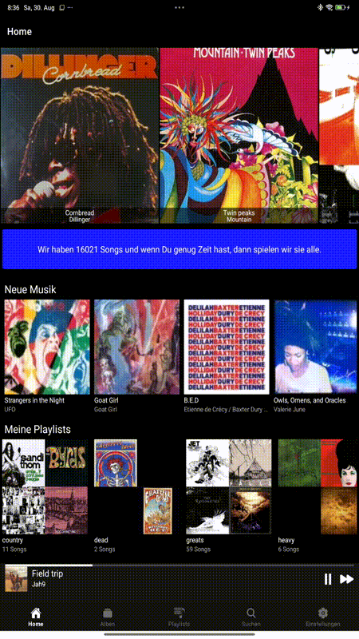

# BSEtunes .NET MAUI client

This is the .NET MAUI cross platform client of the BSEtunes system, which is our private "neighborhood Spotify". With this client you can play single tracks, whole albums, the content of your self created playlists and randomized, the whole content of your selected BSEtunes.

## Android

## IOS

#### Semi Important Information

Due to the copyrights of the streamed music files, the load of our server and perhaps because of the limited bandwidth during the operation of the server, a connection without a login is not possible. For this reason you will need a user account to connect to our server.

- You are not able to register yourself as a user via the app.
- A registration can only be done by the operator of the BSEtunes server.

### Globalization
The App supports globalization. Currently available languages are german and english.

## Libraries

The App was created using the following libraries
- [Prism.DryIoc.Maui](https://prismlibrary.com): MVVM framework for building loosely coupled, modular, maintainable, and testable XAML applications.
- [Microsoft.Maui.Graphics.Skia](https://github.com/dotnet/maui): a cross-platform 2D graphics API for .NET platforms based on Google's Skia Graphics Library.
- [FFImageLoading.Maui](https://github.com/microspaze/FFImageLoading.Maui): Image loading, caching & transforming library for Xamarin
- [CommunityToolkit.Maui.MediaElement](https://github.com/CommunityToolkit/Maui): Control for playing video and audio

## BSE System

The whole BSE system constists of the following components

- BSEadmin: a Windows client for to adminster the system's music content.
	Its partly described at [code project](https://www.codeproject.com/Articles/43068/BSEtunes)
- BSEtunes UWP client at https://github.com/uwe-e/BSE.Tunes.UWP
- BSEtunes Web API at https://github.com/uwe-e/BSE.Tunes